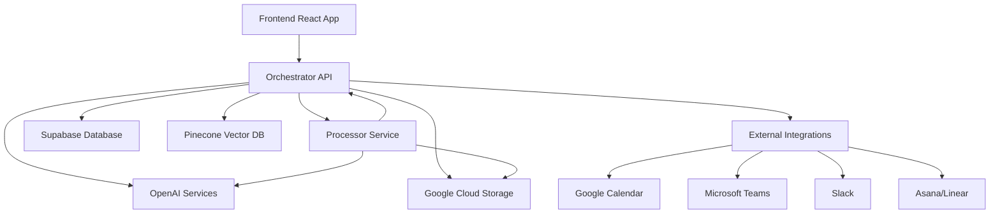

# System Architecture

Sindre is designed as a scalable, AI-powered platform for meeting intelligence and product management. This guide covers the high-level architecture, component interactions, and technical design decisions.

## High-Level Architecture

The Sindre platform consists of three main components that work together to provide comprehensive meeting intelligence:



<CardGroup cols={3}>
  <Card title="Frontend" icon="computer">
    **React Dashboard**
    - User interface for meetings, tasks, and insights
    - Real-time updates via WebSocket
    - Mobile-responsive design
  </Card>
  <Card title="Orchestrator" icon="server">
    **Node.js API Backend**
    - REST API endpoints
    - Business logic and data management
    - Integration orchestration
  </Card>
  <Card title="Processor" icon="cpu">
    **Python Processing Engine**
    - Audio transcription and analysis
    - AI-powered content extraction
    - Background task processing
  </Card>
</CardGroup>

## Orchestrator API Architecture

The Orchestrator follows a clean **Model-View-Controller (MVC)** pattern with clear separation of concerns:

### MVC Layer Structure

<Tabs>
  <Tab title="Routes Layer">
    ```javascript
    // Define HTTP endpoints and middleware
    src/routes/
    ├── meetingRoutes.js     // Meeting CRUD endpoints
    ├── tasksRoutes.js       // Task management endpoints
    ├── betsRoutes.js        // Strategic bet endpoints
    └── integrationRoutes.js // External service endpoints
    ```
    
    **Responsibilities:**
    - HTTP endpoint definitions
    - Request routing and middleware
    - Authentication and validation
    - Parameter extraction
  </Tab>
  <Tab title="Controllers Layer">
    ```javascript
    // Handle HTTP requests and responses
    src/controllers/
    ├── meetingController.js     // Request validation and response formatting
    ├── tasksController.js       // Error handling and status codes
    ├── betsController.js        // Business logic orchestration
    └── integrationController.js // Service layer coordination
    ```
    
    **Responsibilities:**
    - Request validation and parsing
    - Response formatting and status codes
    - Error handling and logging
    - Service layer coordination
  </Tab>
  <Tab title="Services Layer">
    ```javascript
    // Business logic and data operations
    src/services/
    ├── meetingService.js     // Meeting business logic
    ├── tasksService.js       // Task management logic
    ├── betsService.js        // Strategic bet logic
    └── integrationService.js // External API interactions
    ```
    
    **Responsibilities:**
    - Core business logic
    - Database operations
    - External API calls
    - Data validation and transformation
  </Tab>
</Tabs>

### Additional Components

<AccordionGroup>
  <Accordion icon="shield" title="Middleware Layer">
    ```javascript
    src/middleware/
    ├── authenticateUser.js  // JWT token validation
    ├── rateLimiting.js      // API rate limiting
    ├── errorHandler.js      // Global error handling
    └── requestLogger.js     // Request/response logging
    ```
    
    Handles cross-cutting concerns like authentication, rate limiting, and logging.
  </Accordion>
  
  <Accordion icon="plug" title="External Clients">
    ```javascript
    src/external-clients/
    ├── googleClient.js      // Google Calendar & Cloud APIs
    ├── microsoftClient.js   // Microsoft Teams integration
    ├── asanaClient.js       // Asana project management
    ├── linearClient.js      // Linear issue tracking
    └── recallClient.js      // Recall meeting bot API
    ```
    
    Abstraction layer for external service integrations with error handling and retry logic.
  </Accordion>
  
  <Accordion icon="tools" title="LangChain Tools">
    ```javascript
    src/tools/
    ├── taskCreationTool.js    // AI task extraction
    ├── insightCreationTool.js // Meeting insight generation
    ├── peopleQueryTool.js     // Contact information lookup
    └── betsQueryTool.js       // Strategic bet analysis
    ```
    
    LangChain-compatible tools that provide structured AI capabilities for content analysis and extraction.
  </Accordion>
  
  <Accordion icon="webhook" title="Webhook Handlers">
    ```javascript
    src/webhook-handlers/
    ├── googleWebhookHandler.js    // Google Calendar events
    └── microsoftWebhookHandler.js // Microsoft Teams events
    ```
    
    Process incoming webhooks from external services for real-time meeting updates.
  </Accordion>
</AccordionGroup>

## Data Architecture

### Database Design

Sindre uses **Supabase (PostgreSQL)** with Row Level Security for multi-tenant data isolation:

<Tabs>
  <Tab title="Core Tables">
    ```sql
    -- Core entity tables
    meetings (
      id, title, description, transcription,
      scheduled_start_time, duration, processing_status,
      user_id, space_id, created_at
    )
    
    tasks (
      id, title, description, status, priority,
      due_date, assignee_id, meeting_id,
      user_id, space_id, similarity_score
    )
    
    bets (
      id, title, description, status, target_date,
      success_criteria, progress, owner_id,
      user_id, space_id
    )
    ```
  </Tab>
  <Tab title="Relationship Tables">
    ```sql
    -- Supporting relationship tables
    people (
      id, name, email, role, organization_id,
      user_id, space_id
    )
    
    organizations (
      id, name, type, industry,
      user_id, space_id
    )
    
    task_comments (
      id, content, task_id, user_id,
      parent_id, mentions, created_at
    )
    ```
  </Tab>
  <Tab title="Analytics Tables">
    ```sql
    -- Analytics and insights
    insights (
      id, type, title, content, priority,
      meeting_id, user_id, space_id
    )
    
    spaces (
      id, name, description, settings,
      owner_id, created_at
    )
    
    integrations (
      id, service_name, credentials, settings,
      user_id, space_id, status
    )
    ```
  </Tab>
</Tabs>

### Vector Database

**Pinecone** stores embeddings for semantic search:

```javascript
// Vector storage for semantic search
{
  id: "meeting_123_chunk_1",
  values: [0.1, 0.2, ...], // 1536 dimensions (OpenAI embeddings)
  metadata: {
    type: "meeting_transcript",
    meetingId: "123",
    timestamp: "2024-01-01T10:00:00Z",
    speaker: "John Doe",
    content: "We need to prioritize the user authentication feature..."
  }
}
```

## AI Processing Pipeline

### Meeting Processing Flow

<Steps>
  <Step title="Audio Upload">
    - File uploaded to Google Cloud Storage
    - Meeting record created in database
    - Processing webhook triggered
  </Step>
  <Step title="Transcription">
    - Audio sent to OpenAI Whisper
    - Speaker diarization performed
    - Transcript chunks created and stored
  </Step>
  <Step title="Content Analysis">
    - LangChain processes transcript
    - Tasks, insights, and bets extracted
    - People and organizations identified
  </Step>
  <Step title="Vector Storage">
    - Content chunks embedded using OpenAI
    - Vectors stored in Pinecone for search
    - Metadata indexed for filtering
  </Step>
  <Step title="Notifications">
    - Processing completion webhooks sent
    - Integrations triggered (Slack, email)
    - Dashboard updated in real-time
  </Step>
</Steps>

### AI Service Integration

<Tabs>
  <Tab title="OpenAI Services">
    ```javascript
    // OpenAI integration patterns
    const openaiServices = {
      transcription: "whisper-1",        // Audio → Text
      analysis: "gpt-4o",               // Content analysis
      embeddings: "text-embedding-ada-002", // Semantic vectors
      chat: "gpt-4o"                    // Conversational queries
    };
    ```
  </Tab>
  <Tab title="LangChain Framework">
    ```javascript
    // LangChain conversation management
    const conversationChain = {
      memory: "ConversationSummaryMemory", // Context retention
      tools: ["TaskCreationTool", "PeopleQueryTool"], // Structured actions
      prompts: "Custom meeting analysis prompts", // Domain-specific
      parser: "StructuredOutputParser" // Consistent formatting
    };
    ```
  </Tab>
  <Tab title="Vector Search">
    ```javascript
    // Pinecone semantic search
    const searchQuery = {
      vector: await openai.embeddings.create({
        input: userQuery,
        model: "text-embedding-ada-002"
      }),
      filter: {
        userId: currentUser.id,
        type: "meeting_transcript"
      },
      topK: 10
    };
    ```
  </Tab>
</Tabs>

## Integration Architecture

### External Service Patterns

<AccordionGroup>
  <Accordion icon="calendar" title="Calendar Integrations">
    **Google Calendar & Microsoft Teams**
    - OAuth 2.0 authentication flow
    - Webhook subscriptions for real-time updates
    - Meeting metadata synchronization
    - Automatic bot deployment for recordings
    
    ```javascript
    // Calendar integration flow
    1. User authenticates with Google/Microsoft
    2. Webhook subscription created for calendar events
    3. New meeting events trigger bot deployment
    4. Meeting recordings processed automatically
    ```
  </Accordion>
  
  <Accordion icon="comments" title="Chat Integrations">
    **Slack Integration**
    - App installation and OAuth setup
    - Event subscriptions for mentions and messages
    - Thread-based conversation management
    - Meeting summaries posted to channels
    
    ```javascript
    // Slack bot interaction
    1. User mentions @sindre in channel
    2. Event webhook received and processed
    3. Query processed using conversation context
    4. Response posted as thread reply
    ```
  </Accordion>
  
  <Accordion icon="list-check" title="Project Management">
    **Asana & Linear Integration**
    - API token-based authentication
    - Automatic task creation from meeting analysis
    - Bidirectional status synchronization
    - Project and workspace mapping
    
    ```javascript
    // Task synchronization flow
    1. Task extracted from meeting transcript
    2. Similarity check against existing tasks
    3. New task created in Asana/Linear
    4. Task ID linked in Sindre database
    ```
  </Accordion>
</AccordionGroup>

## Security Architecture

### Authentication & Authorization

<Tabs>
  <Tab title="JWT Authentication">
    ```javascript
    // Supabase JWT token structure
    {
      aud: "authenticated",
      exp: 1640995200,
      sub: "user-uuid-here",
      email: "user@example.com",
      app_metadata: {
        provider: "email",
        providers: ["email"]
      },
      user_metadata: {
        full_name: "John Doe"
      }
    }
    ```
  </Tab>
  <Tab title="Row Level Security">
    ```sql
    -- RLS policies for multi-tenant isolation
    CREATE POLICY "Users can only access their own meetings"
    ON meetings FOR ALL
    TO authenticated
    USING (auth.uid() = user_id);
    
    CREATE POLICY "Space members can access shared data"
    ON meetings FOR ALL
    TO authenticated
    USING (
      user_id = auth.uid() OR
      space_id IN (
        SELECT space_id FROM space_members 
        WHERE user_id = auth.uid()
      )
    );
    ```
  </Tab>
  <Tab title="API Security">
    ```javascript
    // Security middleware stack
    app.use(helmet());              // Security headers
    app.use(rateLimiter);           // Rate limiting
    app.use(authenticateUser);      // JWT validation
    app.use(cors(corsOptions));     // CORS configuration
    app.use(validateInput);         // Input sanitization
    ```
  </Tab>
</Tabs>

## Scalability & Performance

### Horizontal Scaling

<AccordionGroup>
  <Accordion icon="server" title="API Scaling">
    - Stateless Node.js processes
    - Load balancing with nginx/ALB
    - Auto-scaling based on CPU/memory
    - Database connection pooling
  </Accordion>
  
  <Accordion icon="database" title="Database Performance">
    - Supabase managed PostgreSQL
    - Read replicas for query scaling
    - Connection pooling with PgBouncer
    - Optimized indexes for common queries
  </Accordion>
  
  <Accordion icon="cloud" title="Background Processing">
    - Google Cloud Tasks for queue management
    - Async processing of audio files
    - Retry logic with exponential backoff
    - Dead letter queues for failed jobs
  </Accordion>
  
  <Accordion icon="search" title="Search Performance">
    - Pinecone vector database
    - Distributed index across multiple pods
    - Metadata filtering for query optimization
    - Caching layer for frequent searches
  </Accordion>
</AccordionGroup>

## Monitoring & Observability

### Application Monitoring

<Tabs>
  <Tab title="Logging">
    ```javascript
    // Structured logging with Winston
    logger.info('Meeting processing started', {
      meetingId: meeting.id,
      userId: user.id,
      duration: meeting.duration,
      timestamp: new Date().toISOString()
    });
    ```
  </Tab>
  <Tab title="Error Tracking">
    ```javascript
    // Error handling and reporting
    app.use((error, req, res, next) => {
      logger.error('Unhandled error', {
        error: error.message,
        stack: error.stack,
        url: req.url,
        method: req.method,
        userId: req.user?.id
      });
    });
    ```
  </Tab>
  <Tab title="Performance Metrics">
    ```javascript
    // Response time and performance tracking
    app.use((req, res, next) => {
      const start = Date.now();
      res.on('finish', () => {
        const duration = Date.now() - start;
        logger.info('Request completed', {
          method: req.method,
          url: req.url,
          statusCode: res.statusCode,
          duration: `${duration}ms`
        });
      });
      next();
    });
    ```
  </Tab>
</Tabs>

## Deployment Architecture

### Container Deployment

```dockerfile
# Multi-stage Docker build
FROM node:18-alpine AS builder
WORKDIR /app
COPY package*.json ./
RUN npm ci --only=production

FROM node:18-alpine AS runtime
WORKDIR /app
COPY --from=builder /app/node_modules ./node_modules
COPY . .
EXPOSE 8080
CMD ["npm", "start"]
```

### Environment Configuration

<Tabs>
  <Tab title="Development">
    - Local development with hot reload
    - SQLite or local PostgreSQL
    - Mock external services
    - Debug logging enabled
  </Tab>
  <Tab title="Staging">
    - Production-like environment
    - Managed database services
    - Real external service integrations
    - Performance monitoring
  </Tab>
  <Tab title="Production">
    - Container orchestration (Kubernetes/ECS)
    - Auto-scaling and load balancing
    - SSL termination and CDN
    - Comprehensive monitoring and alerting
  </Tab>
</Tabs>

## Next Steps

<CardGroup cols={2}>
  <Card
    title="Development Guide"
    icon="code"
    href="/development/mvc-architecture"
  >
    Learn how to work with the MVC architecture and development patterns.
  </Card>
  <Card
    title="API Reference"
    icon="book"
    href="/api-reference/introduction"
  >
    Explore the complete API endpoints and their usage.
  </Card>
  <Card
    title="Integration Setup"
    icon="puzzle-piece"
    href="/integrations/overview"
  >
    Connect Sindre with your external tools and services.
  </Card>
  <Card
    title="Deployment Guide"
    icon="rocket"
    href="/development/deployment"
  >
    Deploy Sindre to your production environment.
  </Card>
</CardGroup>